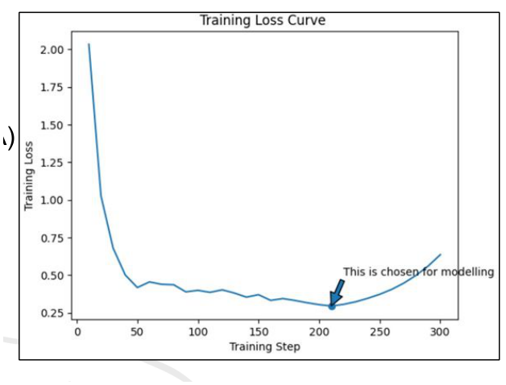
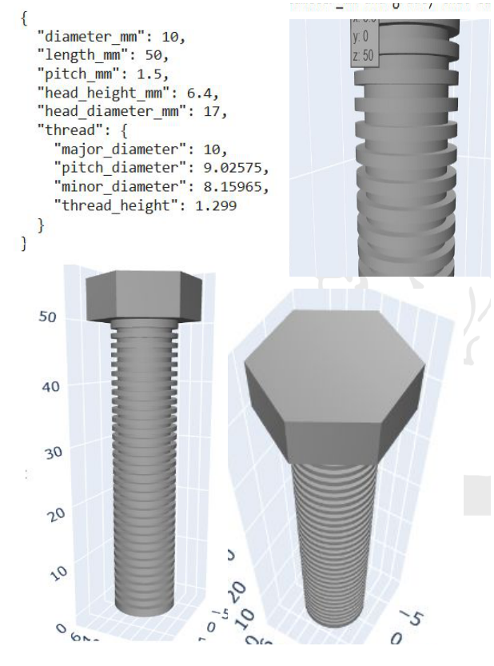
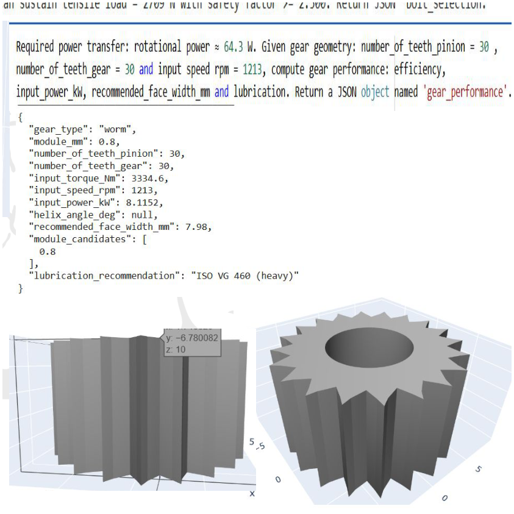
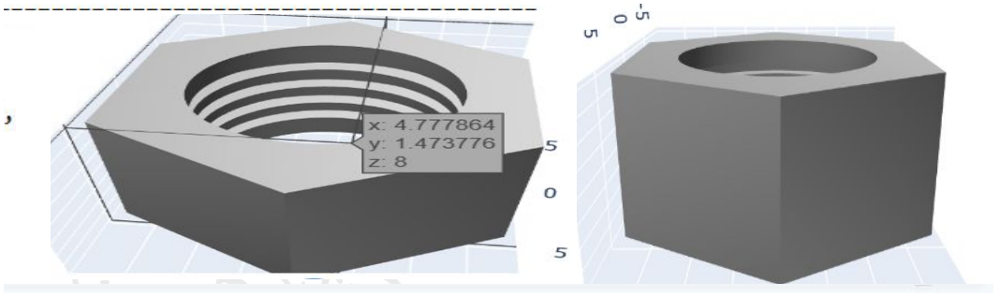
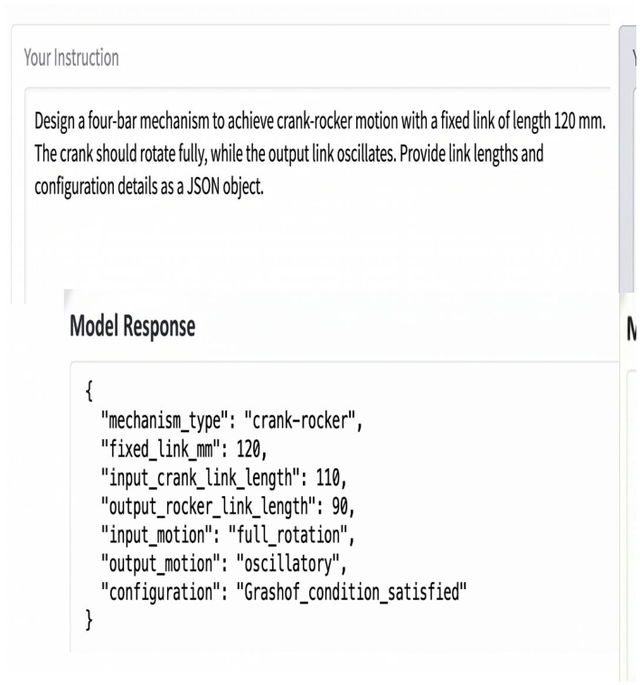
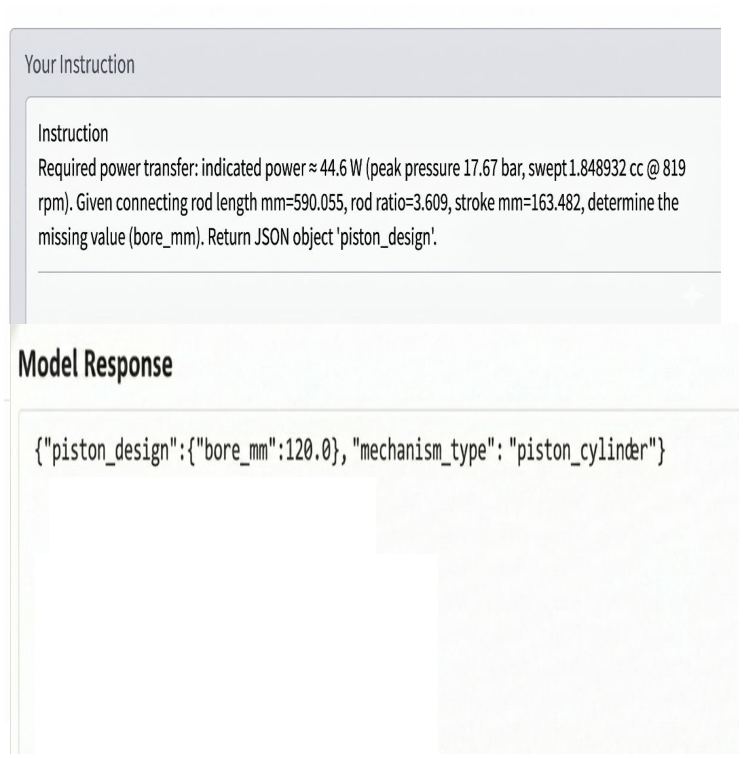

# Generative AI Using LLaMA 3 for Mechanical Systems

**B.Tech Project --- Department of Mechanical & Industrial Engineering,
IIT Roorkee**\
**Academic Year: 2025--26**

A generative-AI framework for converting **high-level natural-language
mechanical engineering requirements into structured CAD parameters and
downstream 3D CAD/STL outputs**.

The project combines a domain-specific engineering dataset, **LLaMA-3-8B
fine-tuned with QLoRA**, structured JSON generation, a regex fallback
parser, engineering constraints, and 3D model generation.

------------------------------------------------------------------------

# Project Team

**Indian Institute of Technology Roorkee**\
**Department of Mechanical & Industrial Engineering**

**B.Tech Project --- 2025--26**

-   Aman Kumar
-   **Kaustubh Dwivedi**
-   Samay Jain
-   Akshay Kumar
-   Priyanshu

**Supervisor:** Prof. Anuj Bisht

The project presentation identifies the five team members and Prof. Anuj
Bisht as supervisor.


## 1. Problem Statement

Traditional mechanical design workflows require domain expertise,
engineering calculations, standards knowledge, and manual CAD modelling.
The project investigates whether a fine-tuned language model can learn a
structured mapping from:

``` text
Engineering Requirements
        ↓
Fine-tuned LLaMA-3
        ↓
Structured CAD Parameters
        ↓
CAD / Mesh Generation
        ↓
STL
```

The intended use case is **preliminary mechanical design assistance**,
particularly for users who may understand the engineering requirement
but have less expertise in manually constructing the corresponding CAD
design.

The presentation identifies applications such as rapid prototyping,
automatic generation of standard parts from specifications, CAD
assistance for junior/non-expert users, and education.
fileciteturn10file0L20-L34

------------------------------------------------------------------------

# 2. Project Objectives

### Domain-specific dataset

The dataset is structured as:

``` text
Engineering Requirements → CAD Parameters
```

and covers mechanical systems including:

-   Bolts & nuts
-   Gears
-   Piston-cylinder assemblies
-   Four-bar mechanisms

The engineering input space includes:

-   Torque
-   Power
-   Load
-   Speed
-   Motion constraints
-   Stress limits
-   Safety factor
-   Material constraints
-   Geometric limits
-   Desired life

These objectives and the division of project work are documented in the
presentation. fileciteturn10file0L37-L66

### Domain adaptation

LLaMA-3-8B was fine-tuned on the mechanical-design dataset using **QLoRA
with 4-bit quantization**. fileciteturn10file0L54-L62

### End-to-end generation

The final objective was an end-to-end pipeline:

``` text
Plain-English Engineering Prompt
              ↓
       Fine-tuned LLaMA
              ↓
       Regex Fallback
              ↓
          JSON Params
              ↓
       Meshy.ai CAD Generation
              ↓
             STL
              ↓
       Plotly 3D Visualization
```

The presentation explicitly describes this pipeline.
fileciteturn10file0L83-L98

------------------------------------------------------------------------

# 3. Dataset and Engineering Inputs

The project generated diverse engineering cases using standard formulas,
design rules, and constraints.

Reported ranges include:

  Variable                Range / description
  ----------------------- -------------------------------
  Speed                   100--3000 rpm
  Torque                  10--5000
  Safety factor           1.0--3.0
  Material                Steel, alloy steel, cast iron
  Geometric constraints   Size / space limits
  Desired life            Fatigue requirements
  Power / load            Application dependent

One representative design prompt from the project is:

> Design a bolted joint to carry a tensile load of 120 kN with a safety
> factor of 2. Use high-strength alloy steel bolts (grade 12.9).
> Determine the appropriate bolt size, thread pitch, and stress area
> based on standard design criteria.

The presentation then sends the requirement through the LLM → fallback
parser → JSON → CAD pipeline. fileciteturn10file0L69-L98

------------------------------------------------------------------------

# 4. Model and Training

## Model

**LLaMA-3-8B**

## Fine-tuning

**QLoRA / LoRA with 4-bit quantization**

## Framework

**HuggingFace Transformers + PEFT**

## Training configuration

  Parameter        Value
  ---------------- --------------------------------
  Training steps   300
  Batch size       10
  Learning rate    Cosine decay, starting at 2e-4
  Optimizer        AdamW 8-bit
  Loss             Cross entropy
  Hardware         Google Colab GPU

These values are taken directly from the project's training setup slide.
fileciteturn10file0L129-L145

### Training result

The reported training curve falls rapidly from the initial loss and
reaches its lowest region around the selected modelling checkpoint.



The project presentation marks the selected region of the training curve
as the checkpoint used for modelling.

------------------------------------------------------------------------

# 5. Inference Architecture

A major design decision was to avoid relying on unconstrained
natural-language model responses.

The expected output is a structured JSON object. If the model response
is malformed or does not cleanly conform to the required structure, the
system uses a **regex-based fallback parser** before passing parameters
to the CAD-generation stage.

``` text
                ┌─────────────────────┐
                │ Engineering Prompt  │
                └──────────┬──────────┘
                           ↓
                ┌─────────────────────┐
                │ Fine-tuned          │
                │ LLaMA-3-8B          │
                └──────────┬──────────┘
                           ↓
                ┌─────────────────────┐
                │ JSON generation     │
                └──────────┬──────────┘
                           ↓
                 malformed / noisy?
                       ↙       ↘
                     yes        no
                      ↓          ↓
                ┌──────────┐     │
                │ Regex    │     │
                │ fallback │     │
                └────┬─────┘     │
                     └──────┬────┘
                            ↓
                  ┌─────────────────┐
                  │ CAD parameters  │
                  └────────┬────────┘
                           ↓
                  ┌─────────────────┐
                  │ CAD / STL       │
                  │ generation      │
                  └─────────────────┘
```

------------------------------------------------------------------------

# 6. Results

The most important part of the project is the **prompt → model output →
generated geometry** evaluation.

Rather than showing only final CAD models, the presentation records the
**sample engineering input and the resulting structured output alongside
the generated 3D geometry**.

------------------------------------------------------------------------

## Result 1 --- Bolt Selection

### Sample input

The model was asked:

``` text
Select a bolt (nominal diameter_mm and grade) that can sustain
tensile load = 2709 N with safety factor >= 2.500.
Return JSON 'bolt_selection'.
```

### Generated structured output

The model produced parameters including:

``` json
{
  "diameter_mm": 10,
  "length_mm": 50,
  "pitch_mm": 1.5,
  "head_height_mm": 6.4,
  "head_diameter_mm": 17,
  "thread": {
    "major_diameter": 10,
    "pitch_diameter": 9.02575,
    "minor_diameter": 8.15965,
    "thread_height": 1.299
  }
}
```

### Generated 3D output



The presentation therefore demonstrates the complete path from a
**natural-language bolt requirement to structured dimensions and a
corresponding 3D bolt visualization**. fileciteturn10file0L101-L105

------------------------------------------------------------------------

## Result 2 --- Gear Performance

### Sample input

The model was given:

``` text
Required power transfer: rotational power ≈ 64.3 W.

Given gear geometry:
number_of_teeth_pinion = 30
number_of_teeth_gear   = 30
input speed             = 1213 rpm

Compute gear performance:
efficiency, input_power_kW,
recommended_face_width_mm and lubrication.

Return a JSON object named 'gear_performance'.
```

### Generated structured output

The resulting JSON included:

``` json
{
  "gear_type": "worm",
  "module_mm": 0.8,
  "number_of_teeth_pinion": 30,
  "number_of_teeth_gear": 30,
  "input_torque_Nm": 3334.6,
  "input_speed_rpm": 1213,
  "input_power_kW": 8.1152,
  "helix_angle_deg": null,
  "recommended_face_width_mm": 7.98,
  "module_candidates": [0.8],
  "lubrication_recommendation": "ISO VG 460 (heavy)"
}
```

### Generated 3D output



This example demonstrates that the model does not only generate a
textual answer: it produces a structured mechanical-design object that
is subsequently visualized as 3D geometry.

------------------------------------------------------------------------

## Result 3 --- Heavy Hex Nut

### Sample input

The project tested:

``` text
Design a heavy hex nut for M20 bolt used in flange coupling
under high vibration.
```

### Generated output

The model returned:

``` json
{
  "size": "M10",
  "length_mm": 12.6,
  "pitch_mm": 1.5,
  "grade": "10.9"
}
```

### Generated 3D output



### Important observation

This is also a useful example of why the system should be treated as a
**preliminary design assistant rather than a final engineering
authority**: the requested bolt specification is M20, while the
displayed model output reports M10.

Rather than hiding this discrepancy, the README records it explicitly
because it is a meaningful limitation of the generated output and
motivates the project's future direction toward stronger constraint
validation and FEA-based verification.

The presentation itself shows this prompt/output pair as one of the
project results. fileciteturn10file0L101-L108

------------------------------------------------------------------------

## Result 4 --- Four-Bar Mechanism

### Sample input

The fine-tuned model was tested with:

``` text
Design a four-bar mechanism to achieve crank-rocker motion
with a fixed link of length 120 mm.

The crank should rotate fully, while the output link oscillates.

Provide link lengths and configuration details as a JSON object.
```

### Generated output

``` json
{
  "mechanism_type": "crank-rocker",
  "fixed_link_mm": 120,
  "input_crank_link_length": 110,
  "output_rocker_link_length": 90,
  "input_motion": "full_rotation",
  "output_motion": "oscillatory",
  "configuration": "Grashof_condition_satisfied"
}
```

### Result visualization



This result demonstrates the model's ability to map a **mechanism-level
kinematic requirement** into structured link parameters and
configuration information. fileciteturn10file0L104-L108

------------------------------------------------------------------------

## Result 5 --- Piston-Cylinder Design

### Sample input

The model received:

``` text
Required power transfer:
indicated power ≈ 44.6 W
peak pressure = 17.67 bar
swept volume = 1.848932 cc
speed = 819 rpm

Given connecting rod length = 590.055 mm,
rod ratio = 3.609,
stroke = 163.482 mm,

determine the missing value (bore_mm).
Return JSON object 'piston_design'.
```

### Generated output

``` json
{
  "piston_design": {
    "bore_mm": 120.0,
    "mechanism_type": "piston_cylinder"
  }
}
```

### Result visualization



This example extends the system beyond individual fasteners and gears to
a higher-level mechanical assembly specification.
fileciteturn10file0L104-L108

------------------------------------------------------------------------

# 7. What These Results Demonstrate

The results collectively demonstrate three layers of the system:

### Layer 1 --- Natural-language engineering understanding

The model accepts prompts describing:

-   loading
-   dimensions
-   speed
-   power
-   safety factors
-   material / grade
-   motion requirements
-   mechanical configuration

### Layer 2 --- Structured engineering output

The model converts those requirements into machine-readable JSON
containing parameters such as:

``` text
diameter
pitch
length
module
number of teeth
link lengths
bore
material / grade
lubrication
configuration
```

### Layer 3 --- 3D model generation

The generated parameters are passed to a downstream CAD/mesh workflow
and visualized as 3D mechanical geometry.

Thus, the central contribution is not simply fine-tuning an LLM. It is
the integration of:

``` text
LLM
 +
Engineering dataset
 +
Structured output
 +
Fallback parsing
 +
Mechanical constraints
 +
CAD generation
```

into a single workflow.

------------------------------------------------------------------------

# 8. Engineering Validation

The underlying project methodology uses engineering equations, design
rules, and constraints to construct the dataset and evaluate generated
parameters.

For example, the project considers:

-   gear geometry and performance
-   bolt sizing
-   tensile / shear loading
-   safety factors
-   mechanism constraints
-   material constraints
-   geometric limits

The detailed project report additionally develops engineering
formulations for gear bending/contact stresses, bolted-joint loading and
preload, and four-bar mechanism relations.

The important distinction is that **LLM-generated parameters are
candidate design parameters**, not automatically certified mechanical
designs.

------------------------------------------------------------------------

# 9. Final Outcome

The project presentation reports the following outcomes:

-   A generative-AI framework for automated preliminary mechanical
    design was developed.
-   The system can predict design parameters for multiple component
    types including **spur gears, nuts & bolts, and four-bar
    mechanisms**.
-   Fine-tuned LLaMA-3-8B maps natural-language engineering requirements
    to structured CAD parameters.
-   QLoRA with 4-bit quantization enabled fine-tuning on a **single 14.5
    GB T4 GPU**.
-   An end-to-end workflow from **plain-English prompt to downloadable
    STL** was demonstrated without manual CAD intervention.
    fileciteturn10file0L110-L126

------------------------------------------------------------------------

# 10. Limitations and Research Directions

The observed nut result is one example showing why generated designs
require engineering verification before practical use.

The project's stated future directions are:

### Real industrial CAD data

Move beyond synthetic training data using real industry CAD datasets.

### FEA validation

Add **Finite Element Analysis (FEA)** after model generation to verify
structural integrity before export.

### Closed-loop design

A natural extension is:

``` text
Requirement
    ↓
LLM-generated design
    ↓
CAD
    ↓
FEA / engineering validation
    ↓
Constraint violations
    ↓
LLM redesign
    ↓
Validated candidate
```

The presentation explicitly identifies real industrial CAD datasets and
post-generation FEA validation as future work.
fileciteturn10file0L122-L126

------------------------------------------------------------------------

# 11. Technology Stack

  Component           Technology
  ------------------- --------------------------
  Base model          LLaMA-3-8B
  Fine-tuning         QLoRA / LoRA
  Quantization        4-bit
  ML framework        HuggingFace Transformers
  PEFT                PEFT / LoRA
  Programming         Python
  Structured output   JSON
  Robust parsing      Regex fallback parser
  CAD generation      Meshy.ai
  Visualization       Plotly
  Training hardware   Google Colab T4, 14.5 GB

------------------------------------------------------------------------

# 12. Repository

### Code

[Mechanical Design
Helper](https://github.com/kaustubh473dwivedi/Mechanical_design_helper)

### Dataset

[Project
Dataset](https://drive.google.com/file/d/1JTfdbri79Yi_OuJ1jFydmotRnfy0hg-t/view?usp=sharing)

------------------------------------------------------------------------


# 13. Summary

This project explores the use of large language models as an interface
between **human engineering requirements and mechanical CAD systems**.

The demonstrated workflow is:

``` text
┌──────────────────────────────┐
│ Natural-language requirement │
└──────────────┬───────────────┘
               ↓
┌──────────────────────────────┐
│ Fine-tuned LLaMA-3-8B       │
│ QLoRA / 4-bit               │
└──────────────┬───────────────┘
               ↓
┌──────────────────────────────┐
│ Structured engineering JSON  │
└──────────────┬───────────────┘
               ↓
┌──────────────────────────────┐
│ Regex fallback + constraints │
└──────────────┬───────────────┘
               ↓
┌──────────────────────────────┐
│ CAD / mesh generation        │
└──────────────┬───────────────┘
               ↓
┌──────────────────────────────┐
│ 3D visualization / STL       │
└──────────────────────────────┘
```

The result is a research prototype demonstrating that a domain-adapted
LLM can translate diverse mechanical-design prompts into structured
design parameters and downstream 3D representations, while also exposing
the need for stronger engineering validation before deployment.
